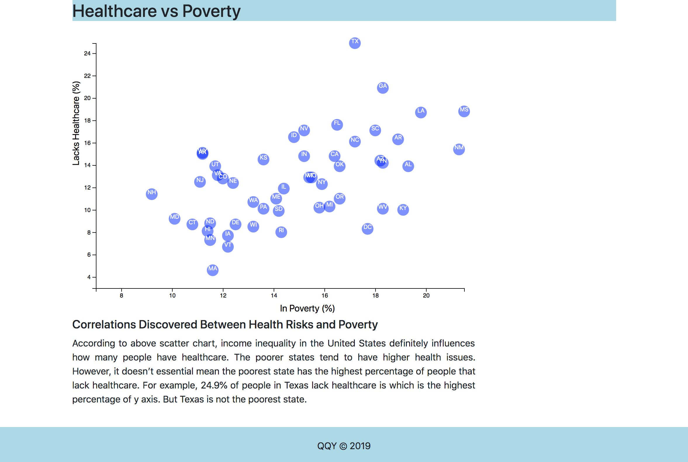

# Data-Journalism-and-D3

## Background

The data set included with the assignment is based on 2014 ACS 1-year estimates: [https://factfinder.census.gov/faces/nav/jsf/pages/searchresults.xhtml](https://factfinder.census.gov/faces/nav/jsf/pages/searchresults.xhtml), but you are free to investigate a different data set. The current data set incldes data on rates of income, obesity, poverty, etc. by state. MOE stands for "margin of error."

### Create a scatter plot about `Healthcare vs. Poverty`.

* Using the D3 techniques to create a scatter plot that represents each state with circle elements. I coded this graphic in the `app.js` file. I pulled in the data from `data.csv` by using the `d3.csv` function. 

* Include state abbreviations in the circles.

* Create and situate axes and labels to the left and bottom of the chart.

